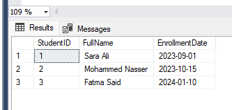

# **Task: Exploring SQL Server Backup Types**

## **Part 1: Research Task**

**1. Full Backup:**

- When it is used:
  - A full backup is used to create a complete copy of the entire database, including all data, objects, and transaction logs. It is typically performed at regular intervals to ensure that a complete snapshot of the database is available.
- What it includes?
  - A full backup includes all data files, system metadata, and transaction logs. It captures the entire state of the database at the time of the backup.
- Pros & cons?
  - Pros:
	- Provides a complete snapshot of the database.
	- Can be used to restore the database to a specific point in time.
	- Simplifies recovery processes.
  - Cons:
	- Takes longer to perform compared to other backup types.
	- Requires more storage space.
	- May impact database performance during the backup process.
- Real-world scenario?
  - In a banking system, a full backup is performed daily to ensure that all transactions and account information are securely stored. This allows for quick recovery in case of data loss or corruption.

**2. Differential Backup:**

- When it is used:
  - A differential backup is used to capture only the changes made to the database since the last full backup. It is typically performed more frequently than full backups to minimize data loss.
- What it includes?
  - A differential backup includes all data that has changed since the last full backup. It does not include data that has not changed.
- Pros & cons?
  - Pros:
	- Faster to perform than full backups.
	- Requires less storage space compared to full backups.
	- Allows for quicker recovery since only changes since the last full backup are captured.
  - Cons:
	- Still requires a full backup to restore the database.
	- If multiple differential backups are taken, restoring can be more complex.
- Real-world scenario?
  - In a content management system, a differential backup is performed every hour to capture changes made to articles and user comments. This allows for quick recovery of recent changes without needing to restore the entire database.

**3. Transaction Log Backup:**

- When it is used:
  - A transaction log backup is used to capture all transactions that have occurred in the database since the last transaction log backup. It is typically performed frequently to minimize data loss.
- What it includes?
  - A transaction log backup includes all transaction log records that have been generated since the last transaction log backup. It captures all changes made to the database.
- Pros & cons?
  - Pros:
	- Allows for point-in-time recovery of the database.
	- Requires less storage space compared to full backups.
	- Can be performed frequently without impacting performance significantly.
  - Cons:
	- Requires a full backup and possibly differential backups to restore the database completely.
	- If transaction logs are not managed properly, they can grow large and consume significant storage space.
- Real-world scenario?
  - In an e-commerce application, transaction log backups are performed every 15 minutes to capture all customer transactions and order updates. This ensures that the system can recover to the most recent state in case of a failure.

**4. Copy-Only Backup:** 

- When it is used:
  - A copy-only backup is used when a backup needs to be taken without affecting the sequence of regular backups. It is often used for ad-hoc backups or testing purposes.
- What it includes?
  - A copy-only backup includes all data files and transaction logs, similar to a full backup, but it does not affect the backup chain or sequence.
- Pros & cons?
  - Pros:
	- Does not interfere with the regular backup schedule.
	- Useful for testing or ad-hoc backups without affecting the backup chain.
	- Can be used to create a backup for a specific purpose without impacting recovery processes.
  - Cons:
	- Cannot be used for regular backups as it does not maintain the backup chain.
	- May lead to confusion if not properly documented.
- Real-world scenario?
  - In a development environment, a copy-only backup is taken before testing a new feature to ensure that the current state of the database can be restored if needed. This allows developers to experiment without affecting the production backup schedule.
	
**5. File/Filegroup Backup:**

- When it is used:
  - A file/filegroup backup is used when only specific files or filegroups within a database need to be backed up. This is useful for large databases where only a portion of the data has changed.
- What it includes?
  - A file/filegroup backup includes only the specified files or filegroups, rather than the entire database. It captures the state of those specific components.
- Pros & cons?
  - Pros:
	- Allows for targeted backups of specific data components.
	- Can reduce backup time and storage requirements for large databases.
	- Useful for databases with large filegroups that do not change frequently.
  - Cons:
	- More complex to manage and restore compared to full backups.
	- Requires careful planning to ensure all necessary components are backed up.
- Real-world scenario?
  - In a data warehousing environment, a file/filegroup backup is performed on a specific filegroup that contains historical data, allowing for faster backups and restores of frequently accessed data without impacting the entire database.
	

## **Part 2: Practice Tasks (using a test database like TrainingDB)**

**Step 1: Create Test Database**
```sql
CREATE DATABASE TrainingDB; 
GO 
USE TrainingDB; 
GO 
CREATE TABLE Students ( 
StudentID INT PRIMARY KEY, 
FullName NVARCHAR(100), 
EnrollmentDate DATE 
); 
INSERT INTO Students VALUES  
(1, 'Sara Ali', '2023-09-01'), 
(2, 'Mohammed Nasser', '2023-10-15'); 
```


**Step 2: Perform Backup Operations**

1. **Full Backup**
```sql
BACKUP DATABASE TrainingDB TO DISK = 'C:\Program Files\Microsoft SQL Server\MSSQL16.MSSQLSERVER\MSSQL\Backup\TrainingDB_Full.bak'; 
```


2. **Insert New Record (simulate data change)**
```sql
INSERT INTO Students VALUES (3, 'Fatma Said', '2024-01-10'); 
```


3. **Differential Backup**
```sql
BACKUP DATABASE TrainingDB TO DISK = 'C:\Program Files\Microsoft SQL Server\MSSQL16.MSSQLSERVER\MSSQL\Backup\TrainingDB_Diff.bak' WITH DIFFERENTIAL; 
```


4. **Transaction Log Backup**
```sql
-- First make sure Recovery Model is FULL 
ALTER DATABASE TrainingDB SET RECOVERY FULL; 
-- Now backup the log 
BACKUP LOG TrainingDB TO DISK = 'C:\Program Files\Microsoft SQL Server\MSSQL16.MSSQLSERVER\MSSQL\Backup\TrainingDB_Log.trn'; 
```


5. **Copy-Only Backup**
```sql
BACKUP DATABASE TrainingDB TO DISK = 'C:\Program Files\Microsoft SQL Server\MSSQL16.MSSQLSERVER\MSSQL\Backup\TrainingDB_CopyOnly.bak' WITH 
COPY_ONLY; 
```


## **Part 3: Real-World Scenario Simulation**

- **Scenario:**

You are a database admin for a hospital system. 
On Sunday you take a full backup. Each night, you take a differential backup. Every hour, you 
back up the transaction log.

- **Challenge Task:**

Design a backup schedule for this hospital system using SQL scripts. Assume the database is 
called HospitalDB. Include:

- Backup frequency 
- Type of backup for each day/time 
- Folder naming and file versioning convention 

- **Deliverable:**

A .sql file or script plan + brief description of the strategy 

---------------------------------------------------------------------

1. Backup Strategy Description:

- Frequency & Types:
  - Full Backup: Every Sunday at 2:00 AM
  - Differential Backup: Every day (Monday to Saturday) at 2:00 AM
  - Transaction Log Backup: Every hour, 24/7
- Folder & File Naming Convention:
  - Backups saved in a base folder like: C:\Program Files\Microsoft SQL Server\MSSQL16.MSSQLSERVER\MSSQL\Backup\HospitalDB
  - Filenames follow the format: HospitalDB_{BackupType}_{yyyyMMdd_HHmmss}.bak

2. SQL Backup Schedule Script:
```sql
--1. Create the HospitalDB database
CREATE DATABASE HospitalDB;

--2. Use the HospitalDB
USE HospitalDB;

--3. Create a sample Patients table
CREATE TABLE Patients (
    PatientID INT PRIMARY KEY IDENTITY(1,1),
    FirstName NVARCHAR(100),
    LastName NVARCHAR(100),
    DateOfBirth DATE,
    Gender CHAR(1),
    AdmissionDate DATETIME
);


--4. Insert sample data into Patients table
INSERT INTO Patients (FirstName, LastName, DateOfBirth, Gender, AdmissionDate)
VALUES 
('John', 'Doe', '1985-02-20', 'M', GETDATE()),
('Jane', 'Smith', '1990-11-15', 'F', GETDATE()),
('David', 'Lee', '1975-07-10', 'M', GETDATE());


--5. BACKUP STRATEGY SECTION

--5.1. FULL BACKUP (Every Sunday at 2 AM)
-- Save as: C:\Program Files\Microsoft SQL Server\MSSQL16.MSSQLSERVER\MSSQL\Backup\HospitalDB\Full\HospitalDB_Full_YYYYMMDD.bak
BACKUP DATABASE HospitalDB 
TO DISK = 'C:\Program Files\Microsoft SQL Server\MSSQL16.MSSQLSERVER\MSSQL\Backup\HospitalDB\Full\HospitalDB_Full_20250525.bak'
WITH FORMAT, INIT, 
     NAME = 'Full Backup of HospitalDB', 
     SKIP, NOREWIND, NOUNLOAD, STATS = 10;


--5.2. DIFFERENTIAL BACKUP (Every night at 2 AM, except Sunday)
-- Save as: C:\Program Files\Microsoft SQL Server\MSSQL16.MSSQLSERVER\MSSQL\Backup\HospitalDB\Differential\HospitalDB_Diff_YYYYMMDD.bak
BACKUP DATABASE HospitalDB 
TO DISK = 'C:\Program Files\Microsoft SQL Server\MSSQL16.MSSQLSERVER\MSSQL\Backup\HospitalDB\Differential\HospitalDB_Diff_20250526.bak'
WITH DIFFERENTIAL,
     INIT, 
     NAME = 'Differential Backup of HospitalDB', 
     SKIP, NOREWIND, NOUNLOAD, STATS = 10;


--5.3. TRANSACTION LOG BACKUP (Every hour)
-- Save as: C:\Program Files\Microsoft SQL Server\MSSQL16.MSSQLSERVER\MSSQL\Backup\HospitalDB\Logs\HospitalDB_Log_YYYYMMDD_HHMM.trn
BACKUP LOG HospitalDB 
TO DISK = 'C:\Program Files\Microsoft SQL Server\MSSQL16.MSSQLSERVER\MSSQL\Backup\HospitalDB\Logs\HospitalDB_Log_20250526_0100.trn'
WITH INIT, 
     NAME = 'Transaction Log Backup of HospitalDB',
     SKIP, NOREWIND, NOUNLOAD, STATS = 10;

```


	
